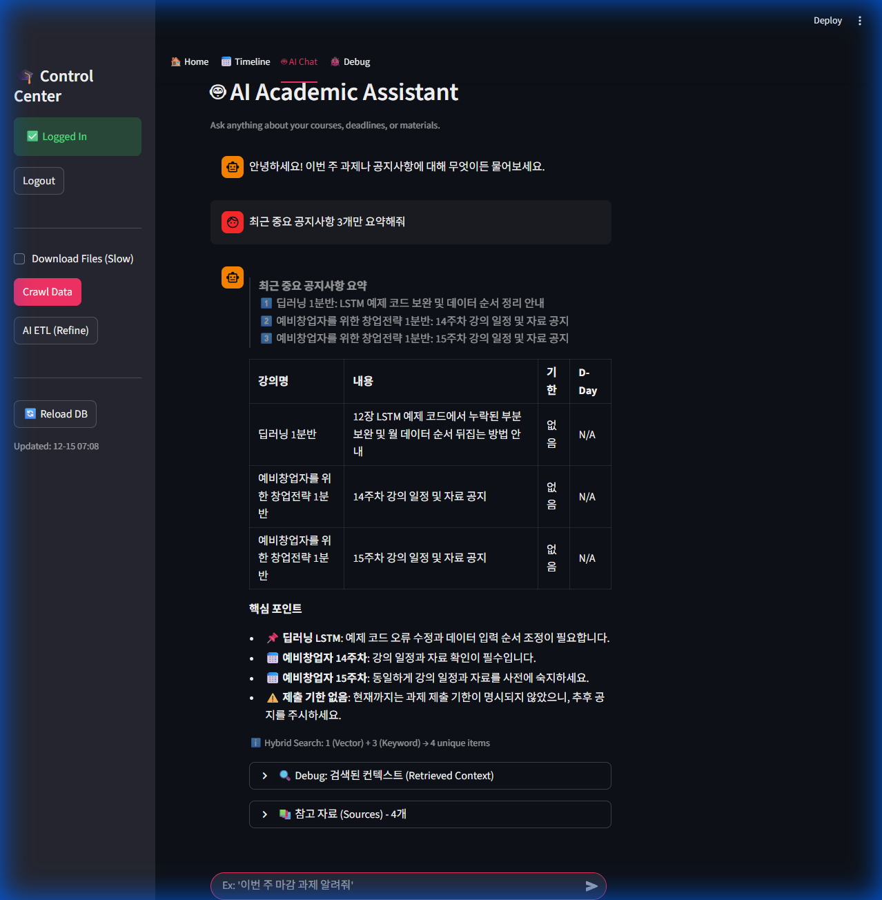
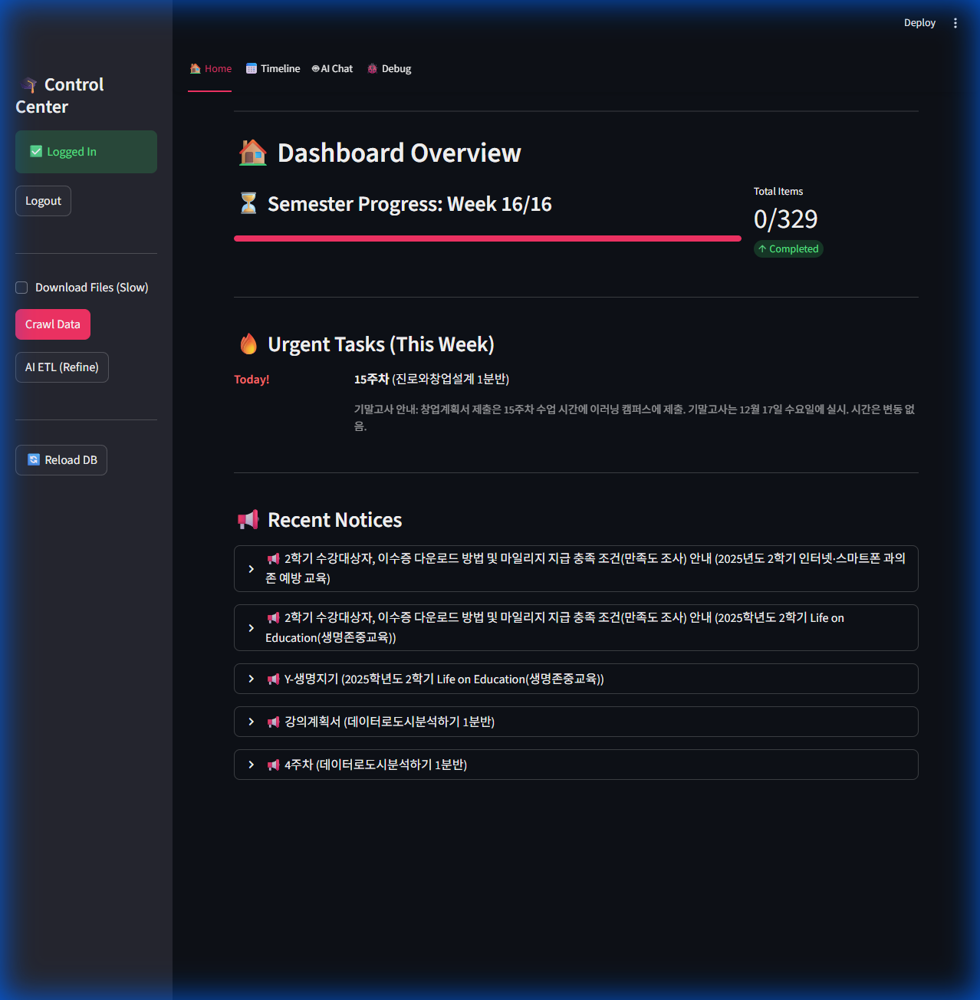

# [Deep Learning Term Project] LLM 기반 지능형 학사 통합 대시보드

## 1. 프로젝트 개요 (Introduction)
본 프로젝트는 **'LLM의 실용적 활용'**에 초점을 맞춘 학사 정보 통합 시스템입니다.  
기존의 파편화된 학교 홈페이지와 이러닝 시스템, 각 과목 별 공지 등을 크롤링하고, 크롤링한 데이터의 비정형 텍스트 데이터를 **Large Language Model (Local LLM)**을 사용하여 구조화하고, **RAG (Retrieval-Augmented Generation)** 기술을 통해 환각(Hallucination) 없이 정확한 학사 정보를 제공합니다.

---

## 2. LLM 활용 전략 (LLM Application Strategy)

### 2.1 모델 선정 및 환경 (Model Selection)
- **Model**: `gpt-oss:20B` (via **Ollama**)
    - 선택 이유: 로컬 환경에서 구동 가능하여 개인정보 보안에 유리하며, API호출로 인한 비용이 발생하지 않습니다.
- **Serving**: Ollama Local API (`localhost:11434`)
- **Memory**: **Mem0** (Vector Store & Memory Layer)

### 2.2 LLM 기반 데이터 정제 (LLM-Driven ETL)
본 프로젝트의 핵심은 **"LLM을 데이터베이스 정규화 도구로 사용"**하는 것입니다.
크롤링된 Raw Data는 "다음 주까지 제출", "중요 공지"와 같이 모호한 자연어로 되어 있습니다. 이를 LLM에 다음과 같은 프롬프트를 주입하여 정형 데이터로 변환했습니다.

> **Prompt Engineering: Data Refinement Specialist**
> ```text
> Role: "You are a Data Refinement Specialist. Today is {today_str}."
> Task: "Clean and Enrich raw academic data."
> Instructions:
> 1. real_date: '다음 주' 같은 상대적 날짜를 'posted_at' 기준으로 계산하여 'YYYY-MM-DD'로 변환하라.
> 2. importance: 1(사소함)~5(중요 시험) 척도로 중요도를 평가하라.
> 3. category: 과제, 시험, 공지, 자료로 분류하라.
> Output: JSON Format Only.
> ```

*   **Why LLM? (vs Regex)**: "다음 주 금요일까지"라는 텍스트는 `posted_at` 날짜에 따라 실제 마감일이 달라집니다. 정규표현식(Regex)으로는 이러한 **문맥(Context) 의존적 날짜 추론**이 불가능하지만, LLM은 게시일과 현재 날짜 관계를 이해하여 정확한 절대 날짜를 계산할 수 있습니다.
*   **Result**: 비정형 텍스트에서 **정확한 마감일(Due Date)**과 **중요도(Importance)**를 추출하여, Rule-based 코딩 없이도 고품질의 DB를 구축했습니다.

---

## 3. RAG 시스템 구현 (RAG Architecture)

### 3.1 하이브리드 검색 전략 (Hybrid Search Strategy)
단순 벡터 검색(Semantic Search)이나 키워드 검색(Keyword Search) 중 하나만 사용할 때 발생하는 한계를 극복하기 위해 **Ensemble Retrieval** 방식을 채택했습니다.

1.  **Semantic Search (Mem0/Vector)**: "AI 과제 언제야?" 질문 시 'AI'와 '인공지능'을 의미적으로 연결하여 검색. (질문 의도 파악 강점)
2.  **Keyword Search (BM25 equivalent)**: "3주차"와 같은 특정 고유명사나 숫자를 정확히 매칭. (정확성 강점)
3.  **Re-ranking Strategy**:
    *   두 검색 결과(Candidate Set)를 병합하고, 중복을 제거(De-duplication)합니다.
    *   사용자의 질문과 관련성이 높은 순서대로 문맥(Context)을 재정렬하여 LLM에 주입함으로써 답변의 정확도를 극대화했습니다.

### 3.2 챗봇 프롬프트 엔지니어링 (Chatbot Prompt Engineering)
검색된 문맥을 바탕으로 답변할 때, 학생이 읽기 편한 구조화된 답변을 유도하기 위해 **System Prompt**에 다음과 같은 제약조건(Constraints)을 명시했습니다.

> **System Prompt: Academic Assistant**
> ```text
> Role: "You are a helpful academic teaching assistant."
> input: Context (JSON Data) + User Question
> Constraints:
> 1. Summary: 핵심 내용은 인용구('>')로 요약하여 두괄식으로 제시.
> 2. Table: 상세 일정은 반드시 마크다운 표(| 강의명 | 내용 | 마감일 | D-Day |)로 출력.
> 3. Tone: 이모지(📅, ⚠️)를 사용하여 시인성 강화.
> 4. Hallucination Control: 정보가 없으면 "정보를 찾을 수 없습니다"라고 명시.
> ```


*그림 1. RAG 기반 AI 챗봇 인터페이스 (Hybrid Search + Table Formatting 적용)*

---

## 4. 시스템 구조 및 기능 (System Features)


*그림 2. 학사 통합 대시보드 메인 화면 (주간 일정, 긴급 과제 시각화)*

### 4.1 전체 파이프라인
1.  **Crawling**: Canvas API/Playwright로 데이터 수집.
2.  **Refinement (LLM)**: `Ollama(gpt-oss:20B)`가 JSON 변환.
3.  **Storage**: `Mem0`(Vector) 및 `structured_db.json`(Meta)에 저장.
4.  **Interaction**: Streamlit 대시보드에서 RAG 기반 질의응답.

### 4.2 주요 기능
- **스마트 대시보드**: LLM이 분석한 중요도(Urgency Score)를 기반으로 '이번 주 가장 급한 일' 자동 선별.
- **학습 맥락 파악**: "이 과제가 3주차 수업 내용과 관련이 있나요?" 식의 꼬리에 꼬리를 무는 질문 가능(Mem0 활용).

---

## 5. 한계점 및 개선 방안 (Limitations & Future Work)

### 5.1 로컬 LLM의 자원 소모 및 속도 (Resource & Latency)
- **문제점**: 20B 모델을 로컬에서 구동하기 위해 높은 VRAM(12GB+)이 요구되며, API 기반 모델 대비 추론 속도가 느려 실시간 응답에 수 초의 지연이 발생합니다.
- **개선안**: sLLM(Small LLM)이나 양자화(Quantization) 모델(4-bit)을 도입하여 경량화하거나, vLLM 등의 추론 가속 엔진 도입을 고려할 수 있습니다.

### 5.2 크롤러의 유지보수성 (Crawler Maintenance)
- **문제점**: Canvas LMS의 HTML 구조가 변경될 경우 `Playwright` 선택자(Selector)가 작동하지 않을 위험이 있어, 주기적인 코드 업데이트가 필요합니다.
- **개선안**: HTML 구조 의존성을 줄이고, 공식 Canvas API(Rest API) 활용 비중을 100%로 높이는 방향으로 전환이 필요합니다.

### 5.3 환각 현상 (Hallucination)
- **문제점**: RAG를 적용했음에도, LLM이 문맥에 없는 날짜를 임의로 생성하거나(Next week -> 특정 날짜 추론 오류), 동명이인 교수를 혼동할 가능성이 여전히 존재합니다.
- **개선안**: `Confidence Score`가 낮은 답변은 사용자에게 "확인 필요" 경고를 띄우거나, 원본 출처(Source Link)를 더 명확히 제시하여 교차 검증을 유도해야 합니다.

---

## 6. 결론 및 성과 (Conclusion)
본 과제를 통해 **LLM이 단순한 챗봇을 넘어 데이터 처리(Data Processing)의 핵심 모듈로 활용될 수 있음**을 확인했습니다.
RAG와 하이브리드 검색을 결합하여 정확한 학사 정보를 제공하도록 하였고,
무엇보다 딥러닝 이론(Transformer, Embedding)을 실제 학사 시스템에 적용해보며, **"비정형 데이터의 가치 창출"**이라는 AI 엔지니어링의 핵심 역량을 체득할 수 있었습니다.

